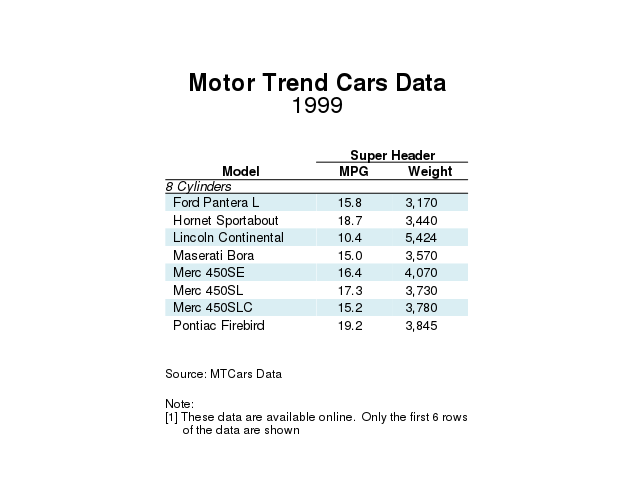

Introduction to ggtable
================

Data
----

For this demonstration, we will use the mtcars data.

``` r
library(ggtable)
library(ggplot2)
library(grid)
library(dplyr)
library(tibble)

data("mtcars")
mtcars <- mtcars %>%
  rownames_to_column("model") %>%
  select(model, mpg, cyl, hp, wt) %>%
  mutate(wt = wt * 1000) %>%
  arrange(cyl, model)
```

Default ggtable
---------------

By default, the table includes all columns as specified in the data.

``` r
t1 <- ggtable(head(mtcars))

t1
```


Add Column Specifications
-------------------------

Use `tcols` to change the selection, order, and format of the columns on the table.

``` r
t1 <- t1 +
  tcols(tcol(var = "model", header = "Model", width = unit(4, "cm")),
        tcol(var = "cyl", header = "Cylinders", width = unit(2, "cm")),
        tcol(var = "mpg", header = "MPG", width = unit(2, "cm")),
        tcol(var = "wt", header = "Weight", width = unit(2, "cm"), format_fun = scales::comma))

t1
```


Add Labels
----------

Use `tlabs` to add labels including titles and notes.

``` r
t1 <- t1 +
  tlabs(title = "Motor Trend Cars Data",
        subtitle = "1999",
        source = "Source:  MTCars Data",
        note = c("Note:",
                 "[1]  These data are available online.  Only the first 6 rows of the data are shown"),
        wrap_len = 60, note_exdent = 6)

t1
```


Add Super Headers
-----------------

Use `theaders` to add super headers to the table.

``` r
t1 <- t1 +
  theaders("Super Header" = c("mpg", "wt"))

t1
```


Change Theme Elements
---------------------

Use `ttheme` to change aesthetic elements of the table. The theme structure mirrors that of ggplot and uses the ggplot theme elements (e.g., `element_text`).

``` r
t1 +
  ttheme(title = element_text(hjust = 0),
         header.super = element_text(color = "red"),
         caption = element_text(size = 6),
         caption.source = element_text(face = "italic"))
```


Add Panels and Page Breaks
--------------------------

Use `tpanels` and `tbreaks` to add panels and page breaks to the table.

``` r
mtcars <- mtcars %>%
  mutate(cyl = paste(cyl, "Cylinders"))

ggtable(mtcars) +
  tcols(tcol(var = "model", header = "Model", width = unit(4, "cm")),
        tcol(var = "mpg", header = "MPG", width = unit(2, "cm")),
        tcol(var = "wt", header = "Weight", width = unit(2, "cm"), format_fun = scales::comma)) +
  tlabs(title = "Motor Trend Cars Data",
        subtitle = "1999",
        source = "Source:  MTCars Data",
        note = c("Note:",
                 "[1]  These data are available online.  Only the first 6 rows of the data are shown"),
        wrap_len = 60, note_exdent = 6) +
  theaders("Super Header" = c("mpg", "wt")) +
  tpanels("cyl") +
  tbreaks(c(12, 24, 32))
```


